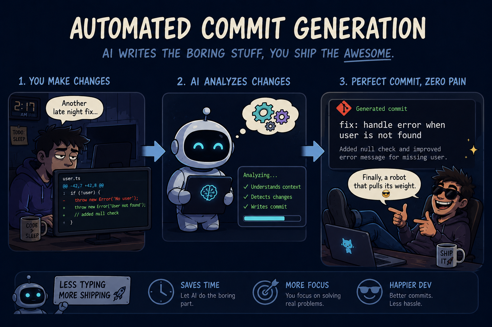

# git-commit-gen



Generate git commit messages automatically using an LLM.

## How it works

- The tool looks at the diff between your current branch and the base branch (default: main)
- It sends the diff to an OpenAI-compatible LLM API
- The LLM generates a commit message based on the diff and your rules.md file
- The commit message is printed to stdout

## Usage

Build:

```bash
go build -o git-commit-gen ./cmd/generator
```

Run:

```bash
git-commit-gen --config configs/generator.toml gen
```

You need to be inside a git repository when running this.

## Configuration

Create a TOML config file (see configs/generator.example.toml):

- **generator.baseBranch** -- branch to diff against (default: main)
- **generator.rulesFile** -- path to rules.md with commit style rules
- **llm.openai.api** -- OpenAI-compatible API URL
- **llm.openai.token** -- API token
- **llm.openai.model** -- model name (default: gpt-4o)
- **llm.proxy** -- optional proxy settings (http or socks5)

Environment variables (OPENAI_TOKEN, OPENAI_API, OPENAI_MODEL, PROXY_TYPE, etc.) can also be used.

## Rules file

The rules.md file contains guidelines for commit message format. The LLM will follow these rules when generating messages. See rules.example.md for an example.

<p align="center">
  <a href="https://tonviewer.com/UQCcbp-mue-7HTjDNQ_ZrKtg-tUxIFu817APmItjXasiBGP3">
    <svg xmlns="http://www.w3.org/2000/svg" width="120" height="28" role="img" aria-label="BUY ME A TON"><title>BUY ME A TON</title><g shape-rendering="crispEdges"><rect width="120" height="28" fill="#0098ea"/></g><g fill="#fff" text-anchor="middle" font-family="Verdana,Geneva,DejaVu Sans,sans-serif" text-rendering="geometricPrecision" font-size="100"><text transform="scale(.1)" x="600" y="175" textLength="960" font-weight="bold">BUY ME A TON</text></g></svg>
  </a>
</p>

<p align="center">
  If this tool helps you, consider buying me a coffee! ☕
</p>
